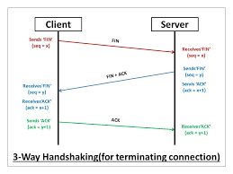

# 握手

**http和握手其实并不对等,握手是tcp干的事**

## 图

## 次数

3次

## 为什么是三次

这个问题的本质是, 信道不可靠, 但是通信双发需要就某个问题达成一致. 而要解决这个问题, 无论你在消息中包含什么信息, 三次通信是保证可靠的理论上的最小值. 所以三次握手不是TCP本身的要求, 而是为了满足"在不可靠信道上可靠地传输信息

### 一次

那叫广播

### 两次

不知道客户端是否正常,直接建链可能会浪费资源

### 四次

没有必要

***
~参考资料~
* [TCP 为什么是三次握手，而不是两次或四次？](https://www.zhihu.com/question/24853633)
