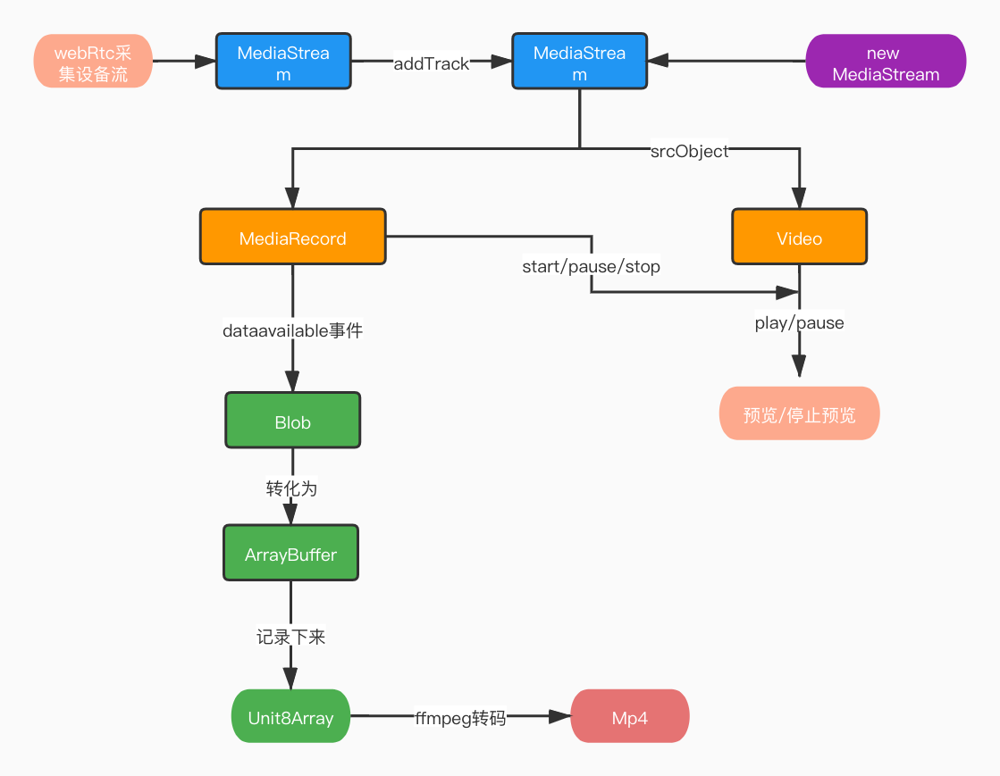

# Mp4Record Demo

## 基本介绍

可以录制mp4,并且可暂停,剪辑没做

## 流程说明

getUserMedia获取用户设备流 -> MediaRecord录制(因为Chrome不支持直接录制mp4,所以只能先录制成webm格式) -> 最后使用ffmpeg转码成Mp4

## demo启动

因为涉及到摄像头和麦克风,所以需要起https的服务

推荐启动本地服务插件:
[anywhere](https://www.npmjs.com/package/anywhere)

> npm i -g anywhere

>anywhere -d 目录 -p 端口号
## 额外说明

ffmpeg-asm是有人把代码转成了js的形式

[ffmpeg-asm来源](https://github.com/bgrins/videoconverter.js)

ffmpeg-asm-worker是自己封装的

只采集了video,可自己改代码实现包含音频采集

本demo使用的语法较高级,如需在低浏览器版本运行请自行转码(注意api兼容性)

暂停时设备采集指示灯依然会亮起(如果想让指示灯不亮，需要调track.stop,不过再次录制时会是一份新的webm数据,无法和之前的buffer合成一份.除非懂webm格式去修改某些字段。也可以就录制成两份数据，最后用ffmpeg拼接)
